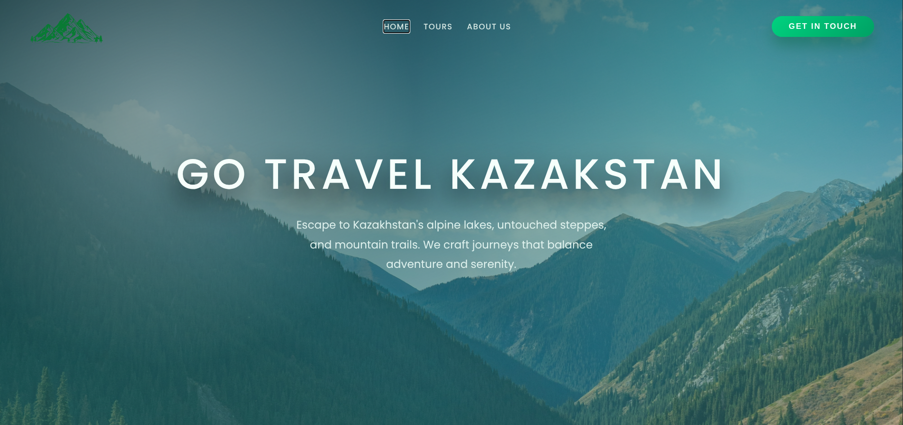

# GoTravelKazakhstan


This Landing Page of Kazakhstan Tour Website

## BACKEND Part

The API part of App is already on <a href="https://express-nine-zeta.vercel.app/">here</a> and also link is in <a href="/src/app/tours-provider.service.ts">Angular service</a>

#### In Short: It is not neccessary to do anything to start application except 
```bash
git clone https://github.com/MBFG9000/kbtu-angular-midterm-project/tree/main
npm install
ng serve
```
